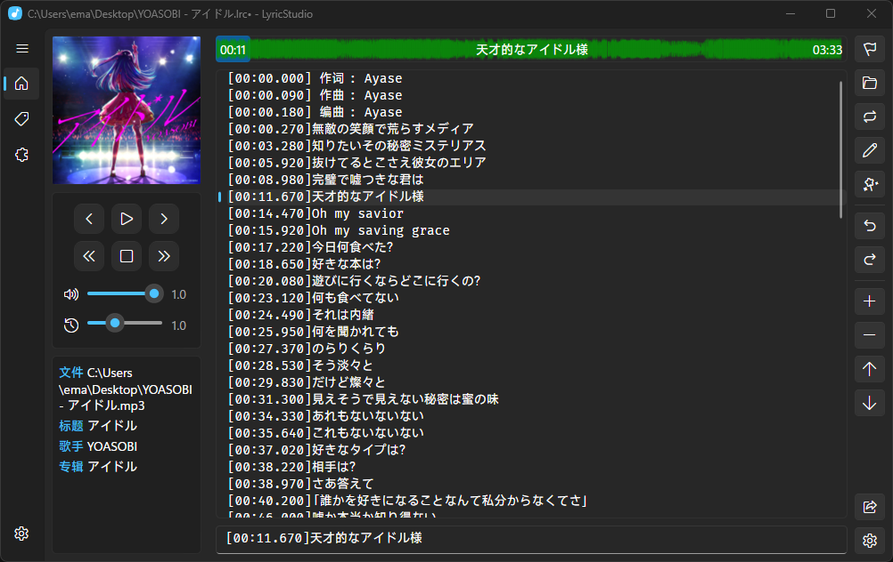
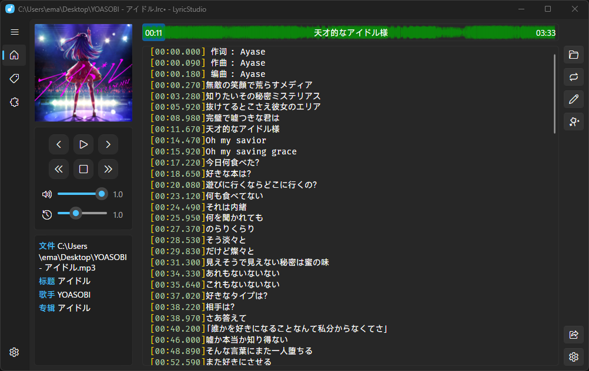
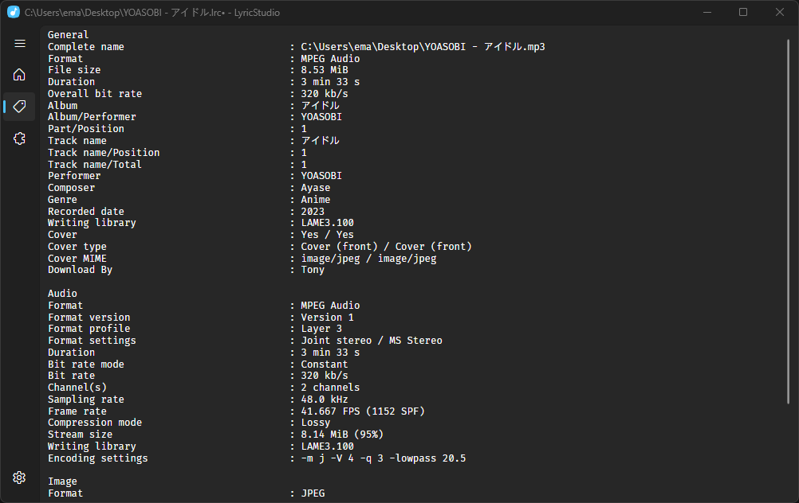

# LyricStudio

LyricStudio is a lyrics editing workstation for editing `.lrc` format lyrics.

Support for translations, Japanese Romanization, Chinese Traditional and Simplified conversion, etc.

Support open lyric format, `.lrc`, `.krc`, `.ass`, etc.

Support to get lyrics from NetEase Cloud, etc.

## Screen Shot

## Framework

Base on Avalonia.

Support Windows 10/11 and MacOS (TBD).

## Thanks

Inspired by the following open source projects:

[BYJRK/LyricEditor](https://github.com/BYJRK/LyricEditor)

[jjzhang166/ZonyLrcTools](https://github.com/jjzhang166/ZonyLrcTools)

[AlexanderDotH/OpenLyricsClient](https://github.com/AlexanderDotH/OpenLyricsClient)

[GenshinMatrix/Fischless](https://github.com/GenshinMatrix/Fischless)

